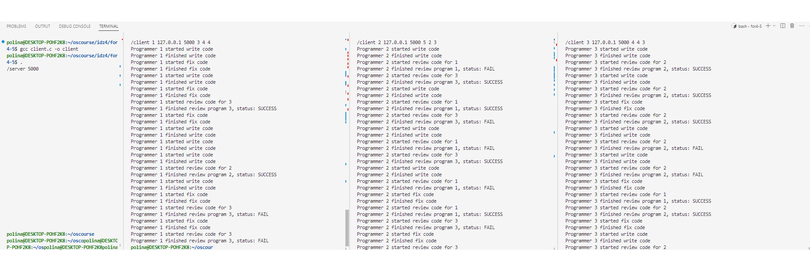
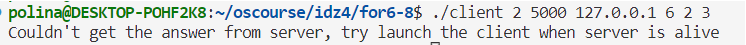
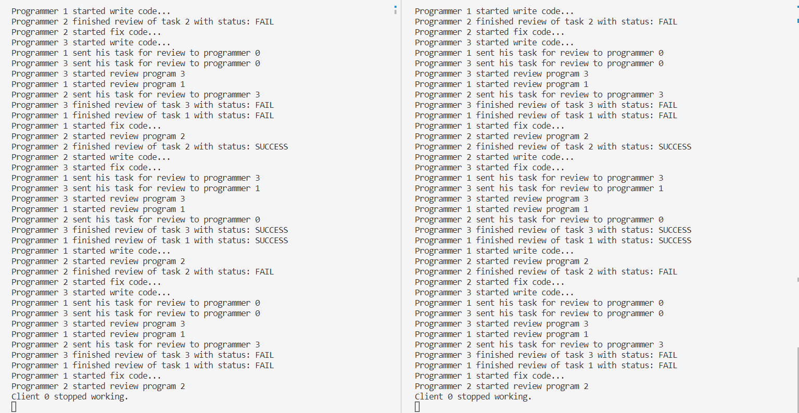

# Индивидуальное домашнее задание №4, Вариант 21
## **Исполнитель**: Копырина Полина Ивановна, группа БПИ213

## **Условие задачи**: Задача о программистах.
В отделе работают три программиста. Каждый программист пишет свою программу и отдает ее на проверку другому случайному программисту. 
Программист переключается на проверку чужой программы, когда его собственная уже написана и передана на проверку. По завершении проверки,
программист возвращает программу с результатом (формируемым случайно по любому из выбранных Вами законов): программа написана правильно или 
неправильно. Программист спит, если отправил свою программу и не проверяет чужую программу. Программист просыпается, когда получает 
заключение от другого программиста. Если программа признана правильной, программист пишет другую программу, если программа признана неправильной, 
программист исправляет ее и отправляет на проверку тому же программисту, который ее проверял. К исправлению своей программы он приступает, 
завершив проверку чужой программы. Проверки и коррекции одной программы могут проходить многократно (правильность программы задается случайным 
образом). При наличии в очереди проверяемых программ и приходе заключения о неправильной своей программы программист может выбирать любую
из возможных работ. Создать приложение, моделирующее работу программистов. Каждый программист — отдельный клиент. Сервер обеспечивает передачу
 данных между клиентами.

## Решение на 4-5
В решении используются дв основные сущности - сервер (server.c) и клиент (client.c). Сущность клиента - это программист из задачи. Так как поведение программистов идентично, то нет необходимости создавать отдельные файлы с кодом для каждого из 3 программистов, достаточно запустить программу client.c три раза в разных процессах.

Чтобы скомпилировать вышеупомянутые файлы, необходимо ввести команды вида:
```
gcc server.c -o server
gcc client.c -o client
```
Сервер инициализируется портом, к которому будет привязан сокет, например:
```
./server 5000
```
При запуске клиент инициализируется 5 аргументами командной строки:
* id клиента (номер программиста, соответствующий процессу) - число от 1 до 3
* IP адрес сервера
* Порт сервера
* Время на написание кода
* Время на ревью
* Время на правку кода

Последние три аргумента - кастомизация работы программиста, столько секунд займет имитация деятельности определенного вида (причем для привнесения элемента случайности время работы рандомно может уменьшиться/увеличиться на 1).

Пример запуска:
```
./client 2 127.0.0.1 5000 5 2 3
```

Сервер хранит массив clients_addr, хранящий адреса клиентов, на которые после отправляются сообщения. Также на сервере хранятся актуальные 
состояния всех трех программ (учитываются только еще не завершенные программы, каждая программа однозначно идентифицируется клиентом).
Сервер выполняет бесконечный цикл, в котором с помощью `recvfrom` считывает поступающие сообщения от клиентов. Каждое сообщение состоит из номера 
программы и её актуального статуса, после получения сообщения сервер обновляет данные у себя и далее смотрит, каким клиентам он может отправить указания о дальнейших действиях. Клиенты принимаются за действия (writeCode, review, fixCode) только после сообщения от сервера.

Клиенты отправляют серверу все отчеты о своих действиях, даже если они дублируют сообщения от сервера с указаниями (например, сервер отправляет "начни писать программу", клиент отправляет серверу "начал писать программу"). В логах пишутся только сообщения от клиентов (отчеты о их действиях, именно они считаются "совершенными по факту").

Сервер хранит для каждого клиента его состояние - активен он или нет (при выключении клиента через ^C он отправляет прощальное сообщение серверу о своем вылете). Все клиенты изначально неактивны. Когда сервер получает сообщение от неактивного клиента (такое первое сообщение - фиктивное, сообщающее серверу id клиента) - он помечает его активным и начинает работу с ним с первого указания "начни писать код".

Для того, чтобы не потерять сообщения, нужно было как-то синхронизировать сервер и клиентов, чтобы клиентам не поступало слишком много сообщений, которые они не 
успевают обработать. Поэтому нужно отправлять клиентам сообщение по одному за 
раз, а следующее отправлять только после того, как они сделали предыдущее 
задание. Для этого на сервере хранятся значения "баланса" для каждого из клиентов 
(`client_balance`) - если значение положительное, то клиент готов принять задание.
Таким образом, когда сервер отправляет задание, баланс уменьшается, а когда
 клиент извещает об окончании какого-то действия, баланс увеличивается.

На каждой итерации после получения обновления состояние сервер просматривает состояния всех программ и пытается отправить новые задания программистам, если это возможно.

При прекращении работы сервера через ^C он отправляет последнее сообщение о своей остановке клиентам, чтобы они тоже завершили свою работу.

Каждый клиент логирует свои действия в терминале, так что на данном этапе отследить историю можно только в терминалах клиентов-программистов.
(скриншот работы можно посмотреть в for4-5/test.png).


Если клиент запускается раньше сервера и не получает от него ответ в течение нескольких секунд, он завершает свою работу с подписью о том, что сервер, вероятно, не работает. (это действует только для первого обмена сообщениями)


## Решение на 6-7, 8
По сути решение на 6-7 является частным случаем программы на 8, поэтому было решено их объединить. 

Добавлена сущность visitor (`visitor.c`), которая подключается к серверу, и он переотправляет посетителю все сообщения от клиентов-программистов. Реализовано это через широковещательную рассылку (broadcast), что позволяет посетителям подключаться и отключаться, не влияя на ход основной программы.

Компиляция:
```
gcc visitor.c -o visitor
```


Для широковещательной рассылки добавлен новый порт (и сокет, соответственно), поэтому немного изменился запуск программы сервера, теперь принимаются следующие аргументы:
* порт для основных клиентов-программистов
* порт для broadcast
* ip для broadcast рассылки

```
./server 5000 8000 255.255.255.255
```

В качестве аргументов командной строки visitor принимает ip адрес сервера и порт рассылки.
```
./visitor 127.0.0.1 8000
```

Пример логов программы приведет в файле for6-8/test.txt (там находятся скопированные логи из консоли).
